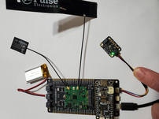
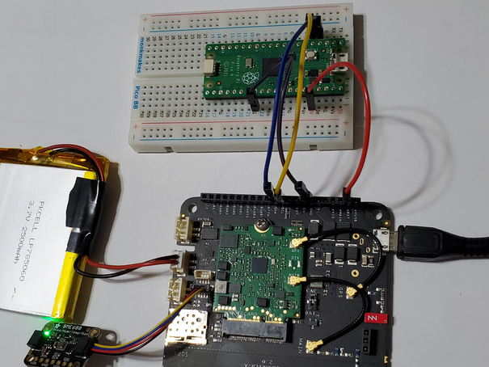

### Description
* Getting started with [Blues Wireless](https://blues.io) notecarriers and notecards
* Using microcontrollers, such as Rasperry PI Pico, Adafruit Feather or QT RP2040

#### Note on power
* For development, both the MCU and the Notecarrier are USB powered to the same computer
* In production, only the Notecarrier is powered, and the MCU receives power from the Notecarrier
* The LiPo ([example](https://www.adafruit.com/product/2011)), connected to the Notecarrier, is optional

### Raspberry Pi Pico
* Using Micropython for rp2040: [link](https://micropython.org/download/rp2-pico/)
* Sensor: Adafruit BME680
* Script _(in progress)_: `pico_notecarrier_a_v2.py`
* Sensor library: [lib/adafruit_bme680.py](https://github.com/bsatrom/notecard-pico) which is a modification for micropython from Adafruit's circuitpython library.
* Need image of Pico and Notecarried powered for production

### Micropython Adafruit Feather RP2040
* Using Micropython for rp2040: [link](https://micropython.org/download/ADAFRUIT_FEATHER_RP2040/)
* Sensor: Adafruit BME680
* Script: `adafruit_qt_feather_rp2040_mp.py`
* Sensor library: [lib/adafruit_bme680.py](https://github.com/bsatrom/notecard-pico) which is a modification for micropython from Adafruit's circuitpython library.
* need image here for both NC-A powered for production

### Circuitpython Adafruit Feather RP2040
* Using Circuitpython
* Sensor: Adafruit BME680
* Script _(in progress)_:
* Sensor library: [Using Adafruit's original library](https://github.com/adafruit/Adafruit_CircuitPython_BME680/blob/main/adafruit_bme680.py) renamed for this project to adafruit_bme680_cp.py
* need image here for both NC-F and NC-A
* need image here for both NC-F and NC-A powered for production

### Images
#### Adafruit Feather RP2040 in Notecarrier F
Notecarrier F Antennas for WBNA-500 Notecard: GPS [Pulse W3908B0100](https://www.digikey.com/en/products/detail/pulse-electronics/W3908B0100/7667475) and for Wireless [Pulse W6112B0100](https://www.digikey.com/en/products/detail/pulse-electronics/W6112B0100/6566097), cut in half.

#### Raspberry Pi Pico

