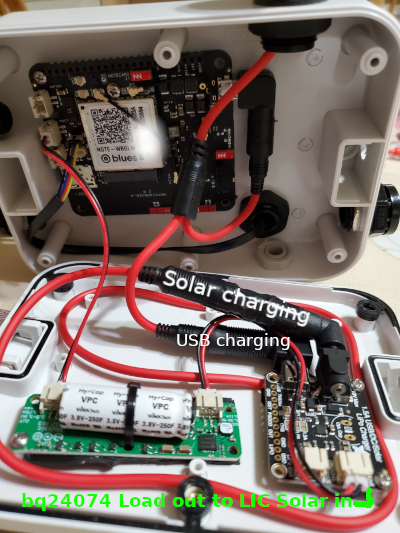

### Monitor power on/off and temperature and humidity w/o a mcu
* Using the Notecarrier A and a Notecard alone __without__ a microcontroller,
* DeviceUID dev:x20894 (NOTE-WBGLW) running firmware notecard-6.2.5.16868
* DeviceUID dev:x17148 (NOTE-WBGLW) running firmware notecard-6.2.5.16868
* DeviceUID dev:x69623 (NOTE-WBNA-500) running firmware notecard-6.2.5.16868
* DeviceUID dev:x77139 (NOTE-WBNA-500) running firmware notecard-6.2.5.16868
* DeviceUID dev:x11049 (NOTE-NBGL-500) running firmware notecard-5.1.1.16026
* DeviceUID dev:x52738 (NOTE-NBGL-500) running firmware notecard-8.2.1.17285 2025-07-28
* DeviceUID (coming soon 7/2025) dev:x22194 (NOTE-NBGL-500)
* Case: Takachi WP11-15-4G/WP10-10-4G with P124/0.3W Solar Panel (Voltaic Systems)
* Sensor: [BME280 from Adafruit](https://www.adafruit.com/product/2652)
* LIC: [Voltaicsystems.com](https://voltaicsystems.com/LIC-solar-charger/)
* [Adafruit bq24074B](https://www.adafruit.com/product/4755)

### Purpose
Two distinct applications using the same configuration
so that the device can be deployed in either one of two environments.

**The first case, which is reporting when USB power is on/off**
* powered by USB,
* have the USB charge the LIC
* and when the USB power fails, then the LIC will take over and send a “USB off/on” alert.
And, the LIC will continue to power the device until the USB power is restored

**The second case is that the device is powered by LIC and charged by solar.**
* There is no USB required.

### Picture and text posted on Blues Forum
* [Reference on Blues Form](https://discuss.blues.com/t/charging-scoop-from-notecarrier-a/2379)

* Two distinct applications using the same configuration, so that the device can be deployed in either one of two environments.

**The first case: the blues device will report to the Notehub when USB power is on/off, that is, it will have some kind of battery backup**

It will be …
* powered by USB,
* have the USB charge the LIC (e.g. Scoop)
* and when the USB power fails, then the LIC will take over and capture the “USB off/on” alert. And, the LIC will continue to power the device until the USB power is restored

**The second case: the blues device is powered by LIC and charged by solar.**
* There is no USB required.

Here is a picture of the current working solution



**Note: in this configuration:**
* the blues device can be powered by either USB or LIC
* the LIC can be charged by either USB or Solar
* the LIC is being charged by the load out of Adafruit’s bq24074, and
* the LIC out is connected to the blues device lipo connection
* Note: this configuration as been tested with Voltaicsystems.com P124 and P126 solar panel
* **Note: [Adafruit is recommending a different configuration](https://forums.adafruit.com/viewtopic.php?t=214945)**

### Notecard Configuration
```
{"req": "card.restore", "delete": true}
{"req": "hub.set", "product": "your-productuid", "mode": "periodic", "voutbound": "usb:60;high:60;normal:60;low:60;dead:0", "vinbound": "usb:1440;high:1440;normal:1440;low:0;dead:0"}
{"req": "hub.sync"}
{"req": "card.triangulate", "mode": "-"}
{"req": "card.voltage", "usb": true, "alert": true, "mode": "usb:4.6;high:3.8;normal:3.6;low:3.2;dead:0"}
{"req": "card.location.mode", "mode": "periodic", "vseconds": "usb:1800;high:1800;normal:1800;low:1800;dead:0"}
{"req": "card.location.track", "start": true, "heartbeat": true, "hours": 1}
{"req": "card.aux", "mode": "track"}
```


### [JSONataExpression](https://try.jsonata.org/): `Route: USB on/off _health.qo` 
* Added voltage 01-Oct-2024

```
{
  "imei_string": $split(device, ":")[1],
  "uptime": "body: " &  $substring($replace($string(body), '\"', "'"), 0, 185),
  "latitude": $string($round(best_lat, 8)),
  "longitude": $string($round(best_lon, 8)),
  "best_location_type": best_location_type,
  "best_location_when": $fromMillis(best_location_when * 1000),
  "which_file": file,
  "when_captured_by_device": $fromMillis(when * 1000),
  "received_by_notehub": $fromMillis(received * 1000),
  "voltage": $string("voltage" in $keys(body) ? $lookup(body, "voltage"))
}
```

### JSONataExpression: `Route: GPS Tracking _track.qo v2`
* Added voltage 01-Oct-2024

```
{
  "imei_string": $split(device, ":")[1],
  "uptime": "body: " &  $substring($replace($string(body), '\"', "'"), 0, 185),
  "temperature": $string($round("temperature" in $keys(body) ? $lookup(body, "temperature"), 2)),
  "humidity": $string($round("humidity" in $keys(body) ? $lookup(body, "humidity"), 2)),
  "pressure": $string($round("pressure" in $keys(body) ? $lookup(body, "pressure"), 1)),
  "latitude": $string($round(best_lat, 8)),
  "longitude": $string($round(best_lon, 8)),
  "best_location_type": best_location_type,
  "best_location_when": $fromMillis(best_location_when * 1000),
  "which_file": file,
  "when_captured_by_device": $fromMillis(when * 1000),
  "received_by_notehub": $fromMillis(received * 1000),
  "voltage": $string("voltage" in $keys(body) ? $lookup(body, "voltage"))
}
```

### Debugging notes
* Reference: https://dev.blues.io/guides-and-tutorials/notecard-guides/debugging-with-the-ftdi-debug-cable/
* Windows: using CoolTerm
* Ubuntu: using Cutecom

<!--
# vim: ai et ts=4 sts=4 sw=4 nu
-->
