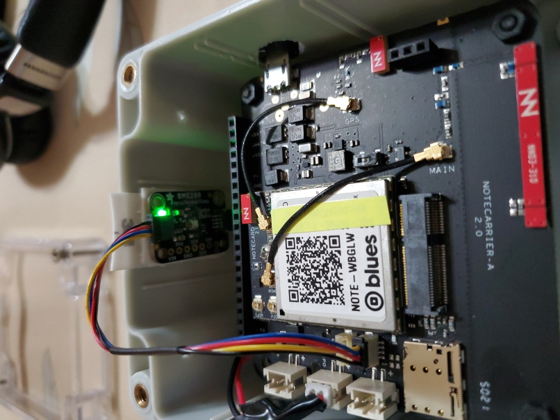

### Monitor power on/off
* Using the notecarrier/notecard alone without a microcontroller,
e.g. Raspberryp Pi Pico or Adafruit RP2040 Feather,  to monitor power on/off
* Not using heartbeat, rather use BME280 sensor attached to Notecarrier A to get hourly checkin





### Setup
```
{"req": "card.restore", "delete": true, "connected": true}
{"req": "hub.set", "product": "<your productUID>"}
{"req": "hub.set", "outbound": 60, "mode": "periodic", "align": true}
{"req": "hub.sync"}
{"req": "hub.get"}
{"req": "card.triangulate", "mode": "-"}
{"req": "card.location.mode", "mode": "periodic", "seconds": 2700}
{"req": "card.location.track","start": true}
{"req": "card.aux", "mode": "track"}
{"req": "card.temp", "minutes": 45}
{"req": "card.voltage", "usb": true, "alert": true, "sync": true}
```

#### Notes
* `{"req": "card.aux", "mode": "track"}` (probably) needs to be enabled for even the `card.temp` working
* The `card.temp` writes every 45 min, and since '`outbound` is sent to 60 min, the device sends a request every hour because there is a new `\_temp.qo` waiting.

### JSONata Expression
* catching two files for temp and tracking info in onr `Route`:
    * `\_temp.qo`
    * `\_track.qo'

```
{
  "imei_string": $split(device, ":")[1],
  "start_time": 0,
  "uptime": "when: " & $fromMillis(when * 1000) &
  ", file: " & file &
  ", where_when: " & $fromMillis(where_when * 1000) &
    ", " & "location(" & best_location_type & "): " &
    $round(where_lat, 8) & "," & $round(where_lon, 8) & ", " &
    $round($lookup(body, "temperature"), 1) & "C/" &
    $round("humidity" in $keys(body) ? $lookup(body, "humidity"):0.0, 1) & "%RH, " &
    "voltage: " & $round($lookup(body, "voltage"), 2),
  "latitude": $string($round(where_lat, 8)),
  "longitude": $string($round(where_lon, 8)),
  "temperature": $string($round($lookup(body, "temperature"), 2)),
  "humidity": $string($round("humidity" in $keys(body) ? $lookup(body, "humidity"):0.0, 2))
}
```

* catching one file, `\_health.qo`
```
{
  "imei_string": $split(device, ":")[1],"start_time":0,
  "uptime": "when: " & $fromMillis(when * 1000) & ", file: " & file & ", why: " &
  $lookup(body, "text") & ", " &
    "location(" & best_location_type & "): " &
    $round(best_lat, 8) & "," & $round(best_lon, 8) & ", " &
    "voltage: " & $round("voltage" in $keys(body) ? $lookup(body, "voltage"):0, 2) ,
  "latitude": $string($round(best_lat, 8)),
  "longitude": $string($round(best_lon, 8))
}
```

<!--
# vim: ai et ts=4 sts=4 sw=4 nu
-->
